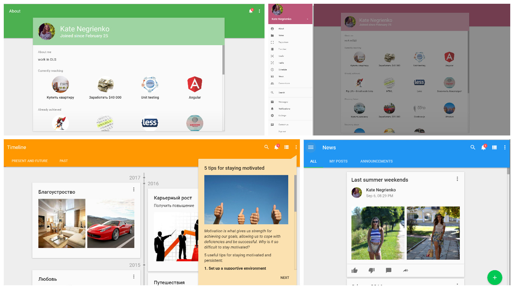

#  <br/> Color Themes


Pip.WebUI 2 Themes module contains a mechanism to define and dynamically switch color themes for both Angular Material and custom controls.

<a href="./doc/images/image.png" style="display: block;">
  
</a>

## Using

1. Add module to imports:
```typescript
import { PipThemesModule } from 'pip-webui-themes-ngx';

@NgModule({
  declarations: [
    AppComponent
  ],
  imports: [
    ...
    PipThemesModule.forRoot({
      defaultThemeName: 'my-own',
      themes: [
        {
          name: 'pip-amber',
          displayName: 'Pip amber',
          info: {
            palette: ThemePalette.Light,
          },
        },
        {
          name: 'my-own',
          displayName: 'My own',
          info: {
            palette: ThemePalette.Dark,
          },
        },
      ],
    }),
    ...
  ],
  providers: [],

  bootstrap: [AppComponent]
})
export class AppModule { }
```

2. Declare themes by importing some default ones or create your own  
2.1 Create directories and define themes
```text
src
└─styles
  └─themes
    ├─pip
    │ ├─pip-amber.theme.scss
    │ └─my-own.theme.scss
    └─theme-base.scss
```
`theme-base.scss`:
```scss
@use '../../app/app-theme' as app;
@use 'node_modules/@angular/material' as mat;
@use "node_modules/pip-webui-themes-ngx/pip-webui-themes-theme" as pip-webui-themes;

@include mat.core();

@mixin create-theme($config-or-theme) {
  // Apply themes of all material components or just some of them
  // if you want to reduce stylesheet size
  @include mat.all-component-themes($config-or-theme);
  // Apply themes styles, e.g. default classes
  @include pip-webui-themes.theme($config-or-theme);
  // Apply your application theme if you have some
  @include app.theme($config-or-theme);
}

```
`pip-amber.theme.scss`:
```scss
@use 'node_modules/@angular/material' as mat;
@use 'node_modules/pip-webui-themes-ngx/themes/pip/amber' as pip-amber;
@use '../theme-base' as base;

// Create the theme from default ones or declare your own
$config: pip-amber.create-theme();

// Then run the base mixin to apply the theme to all components
@include base.create-theme($config);
``` 
`my-own.theme.scss`:
```scss
@use 'node_modules/@angular/material' as mat;
@use '../theme-base' as base;

// Create the theme from default ones or declare your own
$primary: mat.define-palette(mat.$blue-grey-palette, 900);
$accent: mat.define-palette(mat.$blue-grey-palette, 600, A100, A400);
$warn: mat.define-palette(mat.$red-palette, A700);
$config: mat.define-dark-theme((
  color: (
    primary: $primary,
    accent: $accent,
    warn: $warn,
  )
));

// Then run the base mixin to apply the theme to all components
@include base.create-theme($config);
```
2.2 Add themes to the `angular.json` into the 'styles' section. Unfortunately it's not possible to build bundles into the sub directory.
```json
"styles": [
  "src/styles.scss",
  {
    "input": "src/styles/themes/pip/pip-amber.theme.scss",
    "inject": false,
    "bundleName": "pip-amber"
  },
  {
    "input": "src/styles/themes/pip/my-own.theme.scss",
    "inject": false,
    "bundleName": "my-own"
  }
]
```

Use service to change theme, get theme list and name of current theme.
```typescript
import { PipThemesService, Theme } from 'pip-webui-themes-ngx';

export class AppComponent {
  public themes: Theme[];
  public theme: Theme;

  constructor(
    private service: PipThemesService
  ) {
    this.themes = this.service.themes;
    this.theme = this.service.selectedTheme;
  }

  changeTheme(theme: Theme) {
    this.service.selectTheme(theme.name);
  }
}
```

Theme model:
```typescript
class Theme {
  /**
   * Theme name. Should be unique
   */
  name: string;
  /**
   * Theme name to display
   */
  displayName?: string;
  /**
   * Some theme information
   */
  info: {
    palette: ThemePalette;
  } = { palette: ThemePalette.Light };
  /**
   * Custom path for theme loading
   */
  path?: string;
}

enum ThemePalette {
  Light = 'light',
  Dark = 'dark',
}
```

## Installation

To install this module using npm:

```bash
npm install pip-webui-themes-ngx --save
```

## <a name="license"></a>License

This module is released under [MIT license](License) and totally free for commercial and non-commercial use.
